# Flutter  Elements ~ Learn & Quiz App

  The application developed with Flutter contains information about the Periodic Table elements. It also includes explanations about the Periodic Table, groups, periods, elements, blocks, and element types. The application also features a quiz section where you need to select the correct element name based on the element symbol.
  
## Application Screenshots

<table>
  <tr>
    <td>Home Page</td>
       <td>What Is Page</td>
    <td>All Elements Page</td>
    <td>Element Group Page</td> 
  </tr>  
  <tr>
    <td>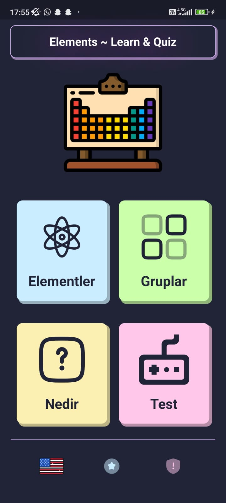</td>
      <td>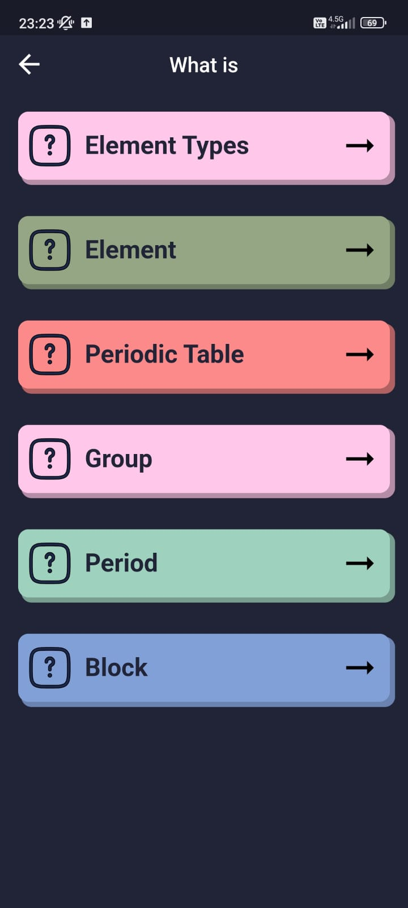</td>
     <td>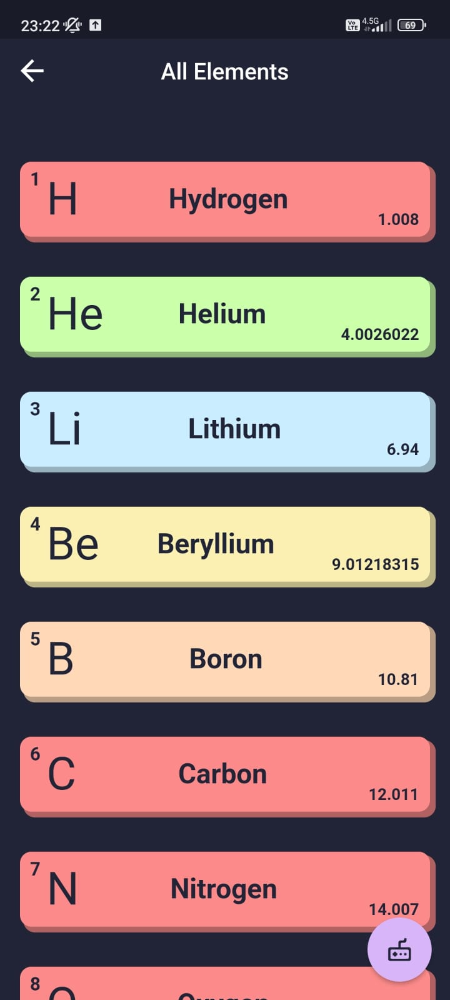</td>
   <td>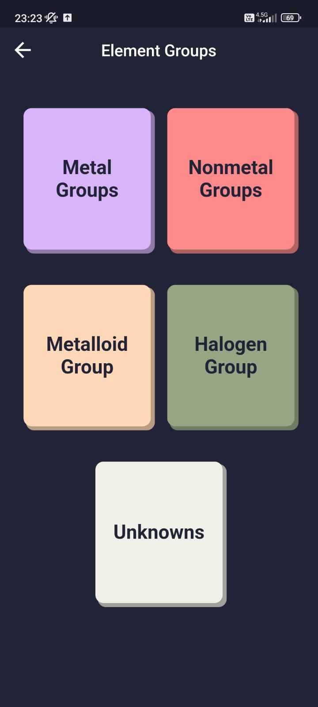</td>
  </tr>
</table>
<table>
  <tr>
    <td>Element Types Page</td> 
       <td>Quiz Page</td>
    <td>Quiz Error </td>
    <td>Loading</td> 
  </tr>  
  <tr>
   <td>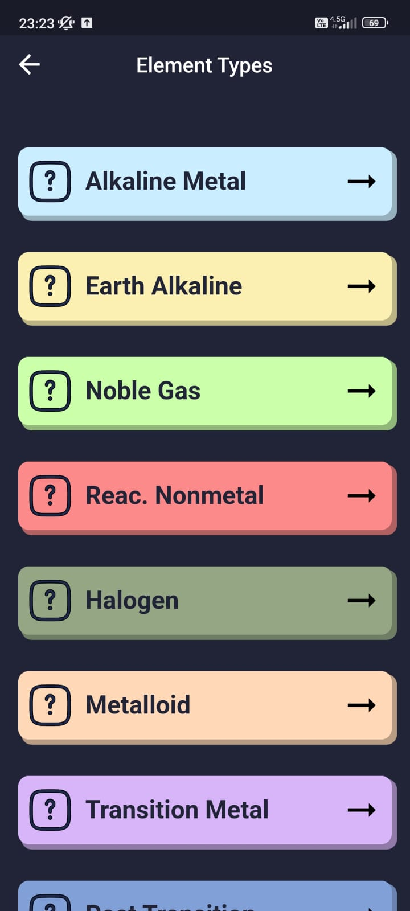</td>
    <td>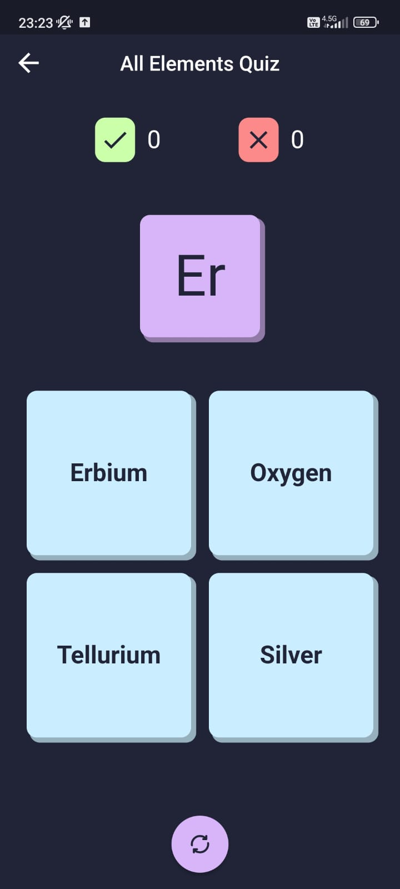</td>
     <td>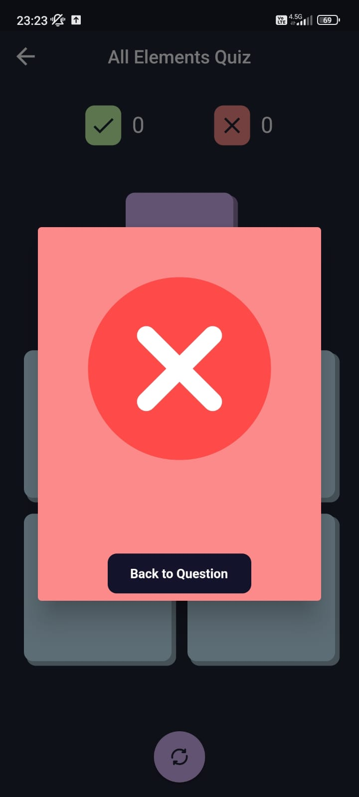</td>
   <td></td>
     
  </tr> 
<table>
  <tr>
        <td>No Connection</td> 
     <td>Element Detail</td> 
        <td>What Is Detail Page</td>
    <td>Feedback</td> 
  </tr>  
  <tr>
      <td>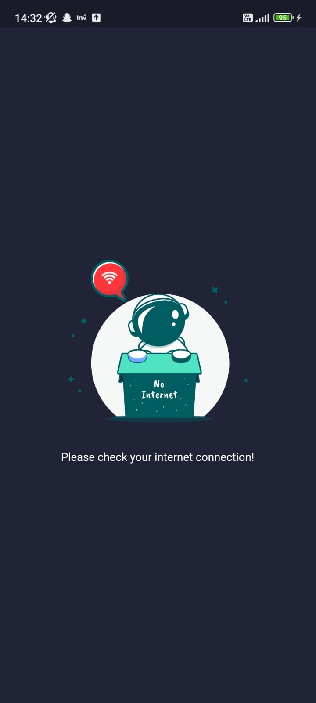</td>
          <td>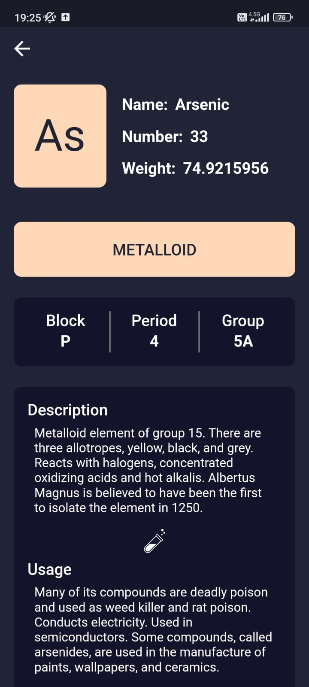</td>
             <td>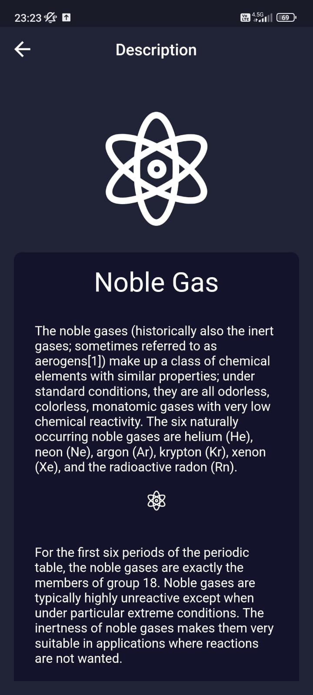</td>
          <td>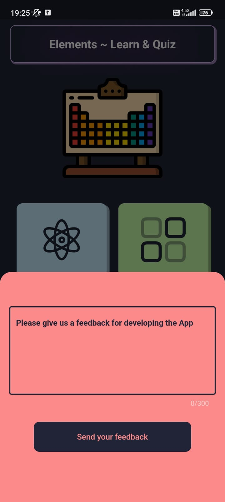</td>
  </tr>
  </table>

  
## Libraries & Technologies
- for data set => https://github.com/furkanagess/periodic_table_data_set
- http => https://pub.dev/packages/http
- equatable => https://pub.dev/packages/equatable
- json_annotation => https://pub.dev/packages/json_annotation
- provider => https://pub.dev/packages/provider
- very_good_analysis => https://pub.dev/packages/very_good_analysis
- lottie => https://pub.dev/packages/lottie
- flutter_svg => https://pub.dev/packages/flutter_svg
- connectivity_plus => https://pub.dev/packages/connectivity_plus
  
