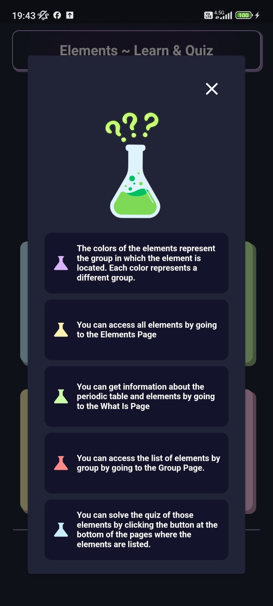
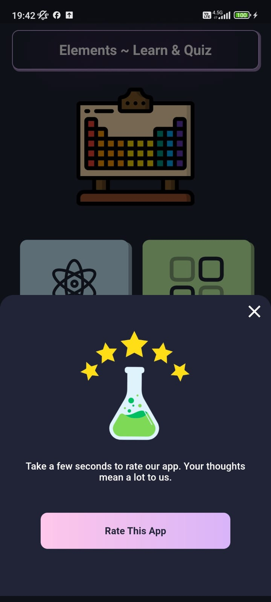

# Flutter | Elements ~ Learn & Quiz App

  The application developed with Flutter contains information about the Periodic Table elements. It also includes explanations about the Periodic Table, groups, periods, elements, blocks, and element types. The application also features a quiz section where you need to select the correct element name based on the element symbol.

## Features
- Language Support (TR-EN)
- Provider State Management
- Internet Connectivity Check
- Version Control
- CI / CD Entegration
- Supports Different Device Screen Sizes
- In-app Ads
- In-app Rating
- Daily Notifications

## Packages & Technologies
- Periodic Table Dataset => https://github.com/furkanagess/periodic_table_data_set
- http => https://pub.dev/packages/http
- equatable => https://pub.dev/packages/equatable
- json_annotation => https://pub.dev/packages/json_annotation
- provider => https://pub.dev/packages/provider
- very_good_analysis => https://pub.dev/packages/very_good_analysis
- build_runner =>  https://pub.dev/packages/build_runner 
- lottie => https://pub.dev/packages/lottie
- flutter_svg => https://pub.dev/packages/flutter_svg
- connectivity_plus => https://pub.dev/packages/connectivity_plus
- google_mobile_ads => https://pub.dev/packages/google_mobile_ads
- flutter_native_splash => https://pub.dev/packages/flutter_native_splash
- firebase_core => https://pub.dev/packages/firebase_core

  
## Application Screenshots

<table>
  <tr>
    <td>Home Page</td>
       <td>What Is Page</td>
    <td>All Elements Page</td>
     <td>Element Detail Page</td> 
     

  </tr>  
  <tr>
    <td></td>
      <td></td>
     <td></td>
         <td></td>

  </tr>
</table>
<table>
  <tr>
    <td>Element Types Page</td> 
       <td>Quiz Page</td>
    <td>Element Group Page</td> 
        <td>What Is Detail Page</td> 
  </tr>  
  <tr>
   <td></td>
    <td></td>
        <td></td>
            <td></td>
  </tr> 
<table>
  <tr>
     <td>Loading</td> 
  <td>No Connection</td> 
 <td>Help</td> 
    <td>Rate</td> 
  </tr>  
  <tr>
           <td></td>
     <td></td>
       <td></td>
     <td></td>
  </tr>
  </table>

## Coding Features
### App Initializer

### Color Extension

### App Provider

---

Privacy Policy

https://github.com/furkanagess/privacy-policy/blob/main/elements-app-privacy-policy.md
  

